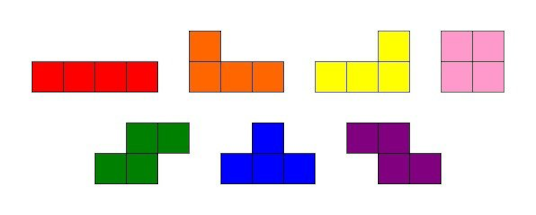
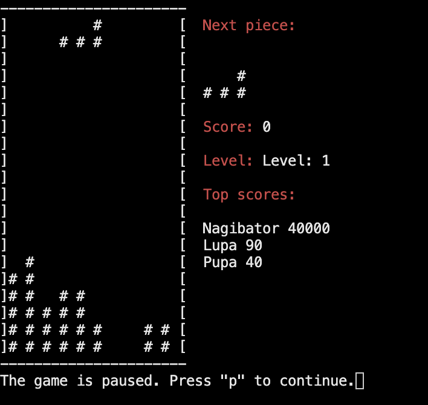

# Документация проекта BrickGame v1.0 aka Tetris

## Оглавление

- [Введение](#введение)
- [Управление](#управление)
- [Архитектура проекта](#архитектура-проекта)
- [Модуль GUI](#модуль-gui)
- [Интерфейс](#интерфейс)
  - [Игровое поле](#игровое-поле)
- [Логика игры](#логика-игры)

## Введение

Этот документ содержит описание проекта BrickGame v1.0 aka Tetris, включая обзор управления, архитектуры и примеры использования.

### Управление


- Старт игры: клавиша 's'
- Движение фигуры: клавиши 'вниз', 'влево', 'вправо'
- Поворот фигуры: клавиша 'r'
- Пауза: клавиша 'p'
- Выход из игры: клавиша 'q'

### Архитектура проекта
```
// src/
// ├── brick_game/
// │   └── tetris/
// │       ├── tetris_game.h
// │       └── tetris_game.c
// └── gui/
// │   └── cli/
// │       ├── main.c
// │       └── interface.c
// │       └── user_input.c
// │       └── top_score.c
// │       └── cli.h
// └── tests/
// │    ├── tests.c
// │    └── tests.h
// │    └── unit_tests.c
```
### Модуль GUI

Взаимодействие интерфейса происходит с помощью концепции Конечного автомата (КА). Используемый КА для данного проекта:

Конечный автомат состои из модулей:

__Start__ - состояние, в котором игра ждет, пока игрок нажмет кнопку готовности к игре

__Spawn__ - состояние, в которое переходит игра при создании очередного блока и выбора следующего блока для спавна.

__Moving__ - основное игровое состояние с обработкой ввода от пользователя

__Action__ - поворот блоков/перемещение блоков по горизонтали и ускоренное падение вниз

__Pause__ - состояние паузы, с ожиданием ввода от пользователя для возобновления игры

__Fix Piece__ - состояние, в которое преходит игра после «соприкосновения» текущего блока с уже упавшими или с землей. Если образуются заполненные линии, то она уничтожается и остальные блоки смещаются вниз. Если блок остановился в самом верхнем ряду, то игра переходит в состояние «игра окончена»

__Game Over__ - игра окончена

### Интерфейс

Интерфейс игры представляет из себя стандартное для игры в тетрис игровое поле размером 10 "пикселей" в ширину и 20 "пикселей" в высоту и дополнительную информацию. Фигуры представляют собой один из 7 вариантов: 


#### Игровое поле



Включает в себя отображение:
- Игровое поле с текущим положением фигур
- Следующая фигура, которая появится на поле
- Количество очков
- Уровень
- Топ игроков (берется из файла top.txt в "онлайн" режиме, с появлением текущего игрока при попадании в ТОП-3 с текущим показанием очков)
- Состояние паузы (при запущенной паузе)

### Логика игры

При запуске игры программа ожидает ввод Имени от пользователя, которое в дальнейшем будет использоваться для добавления в ТОП-лист. 

Далее происходит инициализация игровой структуры, необходимых переменных, подключение необходимых модулей для корректной работы ncurses и отсчитывания времени. 

Запускается цикл по считыванию ввода пользователя с клавиатуры, который обрывается только в случае выхода их игры пользователя. 

Для запуска основной логики программы, она находится в состоянии __GameState_WaitingStart__ ожидается команда от пользователя "Старт" для перехода к игре 

После запуска, программа переходит в состяние  __GameState_Running__: 

- Инициализруется игровое поле с начальным положением рандомной фигуры и генерацией рандомной следующей фигуры и стартовым уровнем = 1

- Независимо от ввода пользователя фигура падает вниз в зависимости от уровня со скорость "1 секунда / уровень"

- В зависимости от ввода пользователя фигура может пермещаться влево, вправо, вниз (при долгом зажатии или множественном - ускоренное падение) или поворачиваться. 
- Также, возможна пауза при соответствующем вводе пользователя. Игра переходит в режим __GameState_Paused__ и ожидает выхода из паузы для последующего перехода обратно в режим __GameState_Running__

- При достижении фигуры дна игрового поля или соприкосновении с уже "заполненными пикселями" фигура фиксируется в текущем положении

- Если при фиксации фигуры происходит полное заполнение строки пикселей, то данная строка ощичается с построчным спуском вниз вышестоящих строк. В зависимости от количества удаленных строк, пользователю начисляются очки:  

  - 1 линия - 100 очков;
  - 2 линии - 300 очков;
  - 3 линии - 700 очков;
  - 4 линии - 1500 очков.

- Если фигура фиксируется и касается потолка игрового поля: игра заканчивается и переходит в состояние __GameState_Over__. В котором происходит очищение выделенной памяти и сброс на состояние ожидания старта игры.

- Во время игры идет подсчет очков пользователя. Каждые набранные 600 очков увеличивается уровень (и соответственно скорость падения фигуры) на 1. Максимальное количество уровней - 10. Запись набранных очков ведется в файл top.txt.

- Количество набранных игроком очков сохраняется в файле top.txt